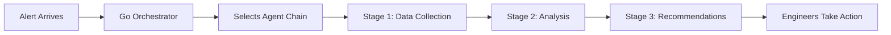
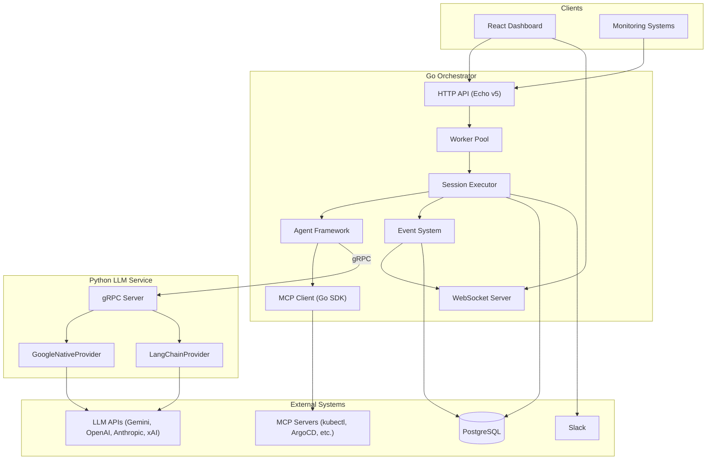
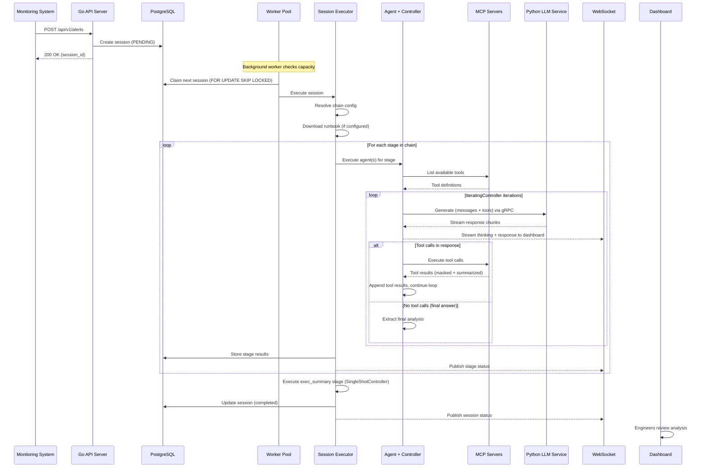
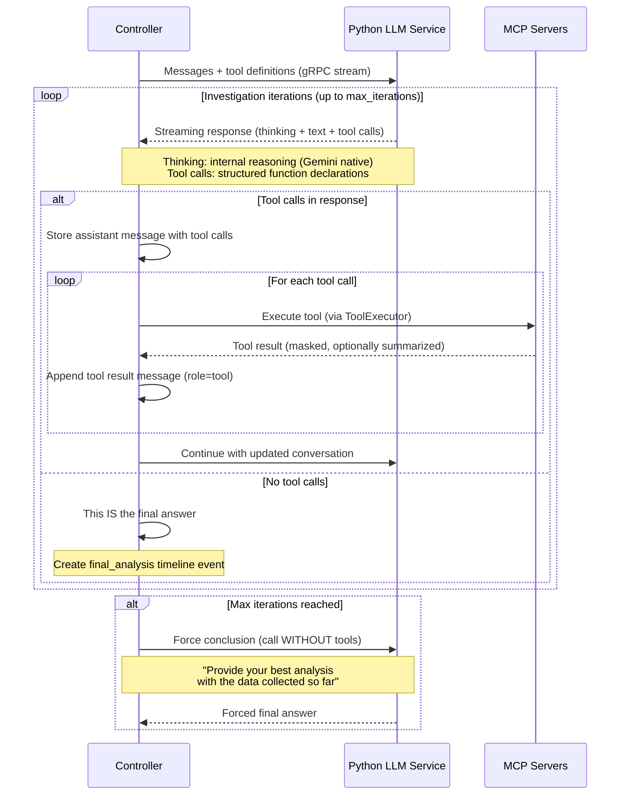
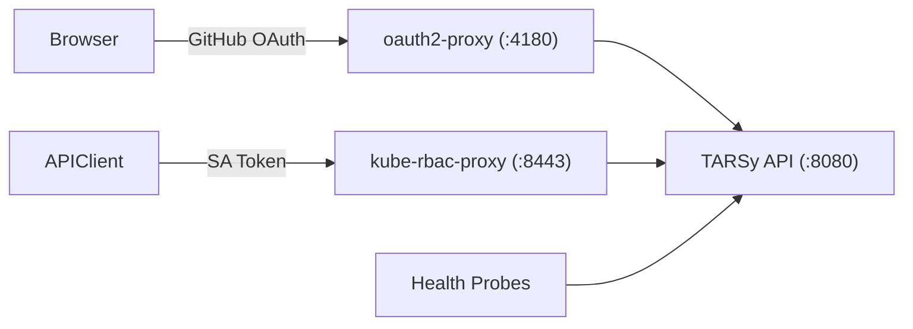
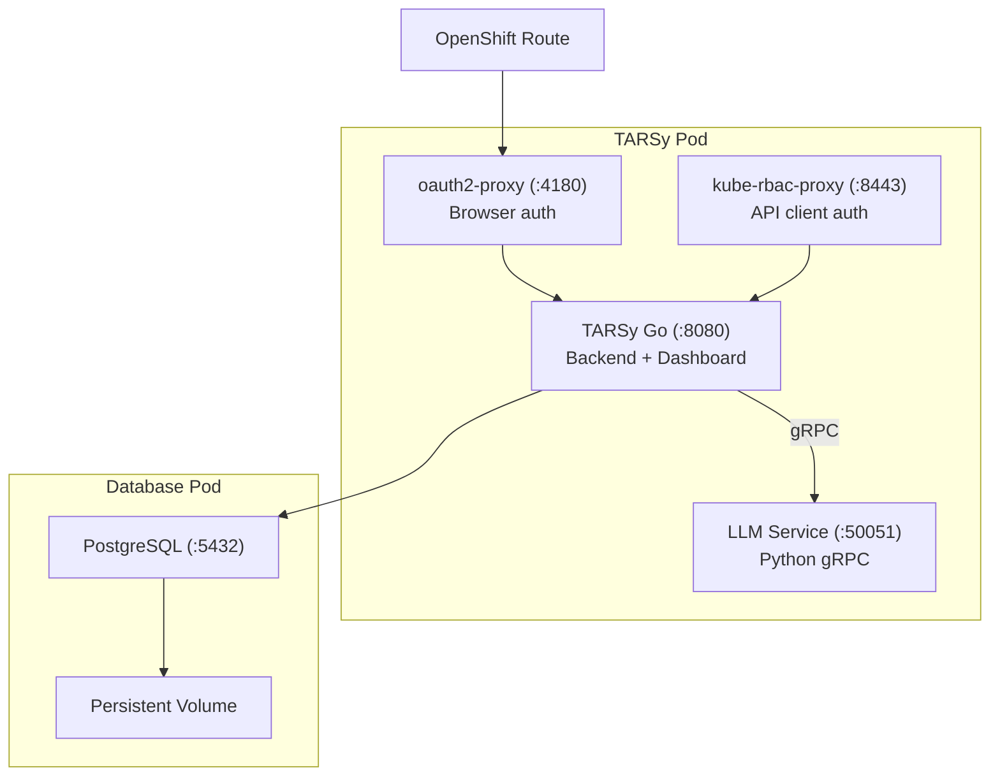

# TARSy - High-Level Architecture Overview

> **For detailed technical implementation**: See [Functional Areas Design Document](functional-areas-design.md)

## What is TARSy?

TARSy is an **AI-powered incident analysis system** built on a Go/Python split architecture. When an alert arrives, TARSy automatically selects the appropriate agent chain, executes multiple stages where specialized agents investigate using external tools (via MCP), and delivers comprehensive analysis and recommendations for engineers to act upon. For complex investigations, an **orchestrator agent** can dynamically dispatch sub-agents based on LLM reasoning, enabling adaptive multi-phase workflows.

The **Go Orchestrator** owns all orchestration logic: session management, chain execution, MCP tool execution, prompt building, conversation management, and real-time WebSocket streaming. The **Python LLM Service** is a stateless gRPC microservice that handles LLM provider interactions (Gemini, OpenAI, Anthropic, xAI, VertexAI), existing solely because LLM provider SDKs have best support in Python.

After an investigation completes, engineers can continue the conversation through **follow-up chat** - asking clarifying questions, requesting deeper analysis, or exploring different aspects of the incident. The chat agent maintains full access to the investigation context and tools, enabling continued exploration without restarting the analysis pipeline.

## Core Concept



## Architecture: Go/Python Split



## Key Components

### 1. Go Orchestrator

The Go backend is the brain of the system. It handles:

- **HTTP API** (Echo v5) for alert submission, session management, chat, and system health
- **Worker pool** with database-backed queue for session processing across multiple replicas
- **Chain execution** with sequential multi-stage workflows and parallel agent support
- **Agent framework** with pluggable iteration controllers
- **MCP client** (Go SDK v1.3.0) for executing external tools with stdio/HTTP/SSE transports
- **Event system** using PostgreSQL LISTEN/NOTIFY for cross-pod real-time streaming
- **WebSocket server** for dashboard live updates
- **Data masking** to prevent sensitive data from reaching LLM providers
- **Slack notifications** for session lifecycle events

### 2. Python LLM Service

A stateless gRPC microservice with a single RPC: `Generate(GenerateRequest) returns (stream GenerateResponse)`. It routes to two provider backends:

- **GoogleNativeProvider**: Gemini models via `google-genai` SDK with native thinking features, thought signatures for multi-turn reasoning, and native function calling
- **LangChainProvider**: Multi-provider support (OpenAI, Anthropic, xAI, Google, VertexAI) via LangChain ecosystem with structured tool calling

The Python service has zero orchestration state and zero MCP knowledge. It receives messages + config via gRPC, calls the LLM provider API, and streams response chunks back.

### 3. Agent Chains & Orchestration

- **Multi-stage workflows** where specialized agents build upon each other's work
- Each chain consists of **sequential typed stages** (`investigation`, `synthesis`, `chat`, `exec_summary`, `scoring`) with data accumulating between stages
- **Flexible chain definitions** via YAML configuration without code changes
- **Parallel execution support** where multiple agents investigate independently within a stage
- **Automatic synthesis** after parallel stages -- a SynthesisAgent unifies findings from multiple agents
- **Replica execution** for running the same agent multiple times with different providers for comparison
- **Dynamic orchestration** -- an orchestrator agent in a chain stage uses LLM reasoning to dispatch sub-agents at runtime, react to partial results, and synthesize findings adaptively

### 4. Specialized Agents & Controllers

Agents are specialized AI-powered components that analyze alerts using domain expertise and configurable iteration controllers. Agent behavior is governed by two orthogonal configuration axes:

- **`AgentType`** (`""` | `"synthesis"` | `"exec_summary"` | `"orchestrator"` | `"scoring"`) — determines which controller runs the agent
- **`LLMBackend`** (`"google-native"` | `"langchain"`) — determines which Python SDK path handles LLM calls

**Two controller types** (text-based ReAct parsing was completely removed):

- **IteratingController**: Multi-turn tool-calling loop with tool definitions bound to the LLM. Works with any `LLMBackend` — `google-native` (Gemini native SDK) or `langchain` (multi-provider). Also used by orchestrator agents with push-based sub-agent result injection.
- **SingleShotController**: Tool-less single LLM call, parameterized via `SingleShotConfig`. Used for synthesis, executive summary, and future scoring

**Forced Conclusion**: When agents reach their maximum iteration limit, the system forces a conclusion -- one extra LLM call without tools, asking the agent to provide the best analysis with available data. There is no pause/resume mechanism.

**Provider Fallback**: All controller paths (iterating, forced conclusion, single-shot) support automatic fallback to alternative LLM providers when the primary fails. Fallback state is tracked per-execution; each new execution resets to the primary provider.

### 5. Orchestrator Agent

The Orchestrator Agent introduces **dynamic, LLM-driven workflow orchestration**. Instead of following a predefined chain of agents, the orchestrator uses LLM reasoning to decide which agents to invoke, what tasks to give them, and how to combine their results — all at runtime. It is a standard TARSy agent (`type: orchestrator`) with three additional tools:

- **`dispatch_agent`** — fire-and-forget sub-agent dispatch, returns immediately
- **`cancel_agent`** — cancel a running sub-agent
- **`list_agents`** — check status of all dispatched sub-agents

Sub-agent results are **pushed automatically** into the orchestrator's conversation — no polling. The controller drains available results before each LLM call and waits when the LLM is idle but sub-agents are pending, enabling multi-phase investigation flows.

Sub-agents are regular TARSy agents discovered via a `SubAgentRegistry` (agents with a `description` field). They run through the same execution path as any agent, creating real `AgentExecution` records linked to the orchestrator via `parent_execution_id`. Four new built-in agents ship with the orchestrator: **Orchestrator**, **WebResearcher** (Gemini google_search + url_context), **CodeExecutor** (Gemini code_execution), and **GeneralWorker** (pure reasoning).

**For detailed design**: See [ADR-0002: Orchestrator Agent](adr/0002-orchestrator-impl.md)

### 6. MCP Integration & Tool Management

- **Go MCP SDK v1.3.0** for external tool integration (kubectl, ArgoCD, monitoring, etc.)
- **Three transport types**: stdio (command-line servers), HTTP (JSON-RPC endpoints), SSE (Server-Sent Events)
- **Per-agent-execution isolation** -- each agent execution gets its own MCP Client with independent sessions
- **Data masking** with hybrid approach: code-based structural maskers (K8s Secrets) + regex patterns
- **Tool result summarization** -- enabled by default for all MCP servers; large results (>5K tokens) are automatically summarized by an LLM call before being sent back to the investigating agent (can be disabled per-server)
- **Health monitoring** -- background service checks server health, attempts recovery, surfaces warnings

### 7. LLM Multi-Provider Support

Built-in support for multiple AI providers with zero-configuration defaults:

| Provider | Default Model | Context Window |
|----------|--------------|----------------|
| Google (default) | gemini-3-flash-preview | 1M tokens |
| OpenAI | gpt-5.2 | 400K tokens |
| Anthropic | claude-sonnet-4-6 | 1M tokens (beta) |
| xAI | grok-4-1-fast-reasoning | 2M tokens |
| VertexAI | claude-sonnet-4-6 | 1M tokens (beta) |

**Per-chain/stage provider configuration**: Different stages can use different LLM providers for cost/performance optimization. Native thinking mode available for Gemini models with exposed internal reasoning.

**Automatic provider fallback**: When a primary provider fails (after Python-level retries are exhausted), the Go controller automatically switches to the next provider in a configurable fallback list. Fallback triggers are error-code-aware — immediate for exhausted retries or missing credentials, after consecutive failures for transient errors. Adaptive streaming timeouts (initial response, stall detection, max call) reduce time wasted on unresponsive providers. Fallback events are recorded in the timeline and surfaced in the dashboard. See [ADR-0003: LLM Provider Fallback](adr/0003-llm-provider-fallback.md) for full design.

### 8. Real-time Dashboard

- **React 19 + TypeScript + Vite 7 + MUI 7** single-page application
- **Session list** with filtering by status, alert type, chain, date range, and full-text search (searches session fields + timeline event content via PostgreSQL FTS with GIN index)
- **In-session search** for terminated sessions — client-side substring matching with highlight, auto-expand of collapsed stages, and match navigation
- **Conversation timeline** with real-time LLM streaming (thinking, tool calls, final answers)
- **Parallel execution tabs** for viewing multiple agent results side by side
- **Orchestrator sub-agent cards** inline in the conversation timeline, with collapsible sub-agent detail and real-time streaming
- **Trace view** with hierarchical LLM/MCP interaction details for debugging, including nested sub-agent traces
- **Alert submission interface** with MCP tool override selection
- **System status page** showing MCP server health and system warnings
- **WebSocket-driven updates** with automatic reconnection and event catchup

### 9. Follow-up Chat

- **Interactive investigation continuation** after sessions reach terminal state (completed, failed, timed out)
- **Context preservation** -- chat agent receives the full investigation timeline as context
- **Same tool access** -- uses the original investigation's MCP server configuration
- **Unified timeline** -- chat messages appear inline with investigation stages
- **Real-time streaming** -- follow-up responses stream through the same WebSocket infrastructure

### 10. Slack Notifications

TARSy can automatically send Slack notifications when alert processing starts (for Slack-originated alerts) and reaches a terminal status (completed, failed, timed out, cancelled). The system supports both standard channel notifications and threaded replies to alert messages via fingerprint correlation.

**For complete Slack setup guide**: See [Slack Integration Documentation](slack-integration.md)

## How It Works

### Alert Processing Flow



### IteratingController Iteration Detail

For agents using the IteratingController, the investigation follows a structured function calling pattern:



### Forced Conclusion at Max Iterations

When an agent reaches its configured `max_iterations` limit, the system forces a conclusion rather than leaving the investigation incomplete. The controller makes one extra LLM call **without tool bindings**, asking the agent to synthesize everything it has learned into a final analysis. This ensures every investigation produces actionable output.

**Hierarchical iteration configuration** allows fine-grained control:
- **System defaults** (e.g., `max_iterations: 20`)
- **Agent-level** override
- **Chain-level** override
- **Stage-level** override
- **Parallel agent-level** override (highest precedence)

### Follow-up Chat

After a session reaches a terminal state (completed, failed, or timed out), engineers can start a chat conversation to ask follow-up questions. The chat agent receives the full investigation timeline as context and has access to the same MCP tools. Responses stream in real-time and appear inline in the conversation timeline.

Chat is a **prompt concern, not a controller concern** -- the same IteratingController and SingleShotController handle both investigation and chat. The `ChatContext` on the execution context triggers chat-specific prompting.

## Authentication & Access Control

TARSy supports two authentication paths for different client types:

### Browser Access (OAuth2-Proxy)

OAuth2-proxy handles GitHub OAuth authentication for browser-based access. The dashboard and API are protected behind cookie-based sessions.

### API Client Access (kube-rbac-proxy)

For programmatic API access in Kubernetes/OpenShift environments, kube-rbac-proxy validates ServiceAccount tokens via the Kubernetes TokenReview API and checks authorization via SubjectAccessReview.



### Development Modes

- **Host dev** (`make dev`): Direct access to TARSy API without authentication
- **Container dev** (`make containers-deploy`): Full stack with OAuth2-proxy for real auth testing
- **OpenShift**: Production deployment with both auth paths active

## Agent Intelligence Model

Each agent operates with three tiers of knowledge composed into its system prompt:

1. **General SRE Instructions**: Universal best practices for incident response
2. **MCP Server Instructions**: Tool-specific guidance from each configured MCP server
3. **Agent Custom Instructions**: Domain expertise specific to the agent's specialty area

For **orchestrator agents** (`type: orchestrator`), an additional behavioral layer is auto-injected after the three tiers — orchestration strategy, sub-agent catalog, and result delivery mechanics. This layer is injected automatically by the prompt builder so that both the built-in `Orchestrator` and custom agents promoted to orchestrator type receive identical behavioral guidance without duplicating it in custom instructions.

Additionally, **runbook content** (fetched from GitHub or using a configured default) is injected into the user prompt for alert-specific investigation procedures.

## Deployment Architecture

TARSy uses a single-pod multi-container architecture:



All 4 containers share localhost network within the pod. The same container images work for both podman-compose (development) and OpenShift (production).

## Extensibility

- **New Agent Types**: Add custom agents via `agents` section in `tarsy.yaml` with MCP servers, instructions, LLM backend, and iteration configuration
- **New MCP Servers**: Integrate additional diagnostic tools via `mcp_servers` section (stdio, HTTP, or SSE transports)
- **New Agent Chains**: Deploy multi-stage workflows via `agent_chains` section with alert type mappings, parallel execution, and synthesis
- **Dynamic Orchestration**: Use `type: orchestrator` agents in chains for LLM-driven sub-agent dispatch with configurable guardrails (`max_concurrent_agents`, `agent_timeout`, `max_budget`) and `sub_agents` overrides at chain/stage/agent level. Agent `type` can be overridden at the stage-agent level, allowing a custom investigation agent to act as an orchestrator in a specific chain without modifying its global definition
- **LLM Provider Configuration**: Override built-in providers or add custom proxy configurations via `llm-providers.yaml`
- **Per-Alert MCP Override**: Fine-grained tool control per alert request via the `mcp_selection` API field
- **Integration Points**: Connect with monitoring systems (AlertManager, PagerDuty) and notification systems (Slack)

**Example chain configuration** (`deploy/config/tarsy.yaml`):
```yaml
agent_chains:
  parallel-investigation:
    alert_types: ["CriticalIncident"]
    llm_provider: "google-default"
    stages:
      - name: "parallel-analysis"
        agents:
          - name: "KubernetesAgent"
            llm_backend: "google-native"
            llm_provider: "gemini-3.1-pro"
            custom_instructions: "Focus on pod health, resource limits, and recent restarts"
          - name: "KubernetesAgent"
            llm_backend: "langchain"
            llm_provider: "anthropic-default"
            custom_instructions: "Focus on networking, service endpoints, and ingress"
        max_iterations: 15
        synthesis_llm_provider: "openai-default"
    chat:
      enabled: true
```

## Next Steps

For detailed technical implementation, file paths, interfaces, data models, and deployment information, see the comprehensive [Functional Areas Design Document](functional-areas-design.md).
